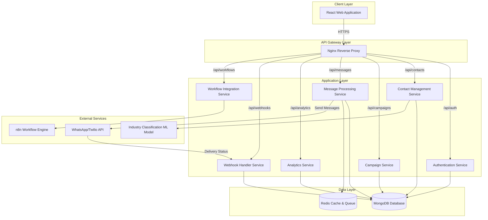
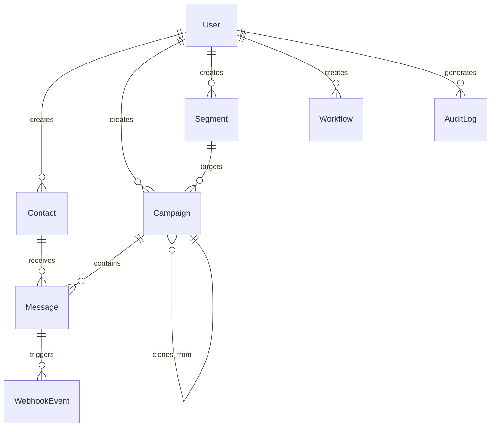

# Design Document: WhatsApp Campaign Automation Platform

## Overview

The WhatsApp Campaign Automation Platform is an enterprise-grade marketing automation system that transforms the existing ML-powered industry classification tool into a comprehensive campaign management solution. The platform enables organizations to manage large-scale contact databases, create targeted marketing campaigns, automate message delivery through WhatsApp, track delivery status in real-time, and analyze campaign performance through comprehensive analytics.

### System Goals

- **Scalability**: Support 500,000+ contacts and 10,000 messages per campaign
- **Reliability**: Maintain 99.5% uptime with automated failover and recovery
- **Security**: Implement enterprise-grade authentication, authorization, and data protection
- **Performance**: Process CSV imports of 10,000 contacts within 60 seconds
- **Usability**: Provide intuitive interfaces for campaign creation and management
- **Extensibility**: Support workflow automation through n8n integration

### Key Features

1. **Multi-User Authentication**: Role-based access control with JWT authentication
2. **Contact Management**: Import, classify, segment, and manage large contact databases
3. **Campaign Management**: Create, schedule, and execute targeted marketing campaigns
4. **Bulk Messaging**: Send personalized WhatsApp messages with media attachments
5. **Real-Time Analytics**: Track delivery status, engagement metrics, and campaign performance
6. **Workflow Automation**: Integrate with n8n for automated campaign workflows
7. **Webhook Integration**: Receive real-time delivery status updates from WhatsApp API
8. **AI Insights**: Optional sentiment analysis and predictive analytics

### Technology Stack

- **Frontend**: React 18+ with Vite, React Router, Chart.js for visualizations
- **Backend**: Node.js 18+ with Express.js framework
- **Database**: MongoDB 6+ with Mongoose ODM
- **Authentication**: JWT (jsonwebtoken) with bcrypt password hashing
- **Message Queue**: Bull queue with Redis for message processing
- **File Processing**: Multer for uploads, xlsx/csv-parser for parsing
- **WhatsApp Integration**: Twilio WhatsApp API or WhatsApp Business API
- **Workflow Engine**: n8n integration via REST API
- **Deployment**: Docker containers on AWS EC2 with Nginx reverse proxy

---

## Architecture

### System Architecture Pattern

The platform follows a **monolithic architecture with modular service layers** for initial deployment, with clear separation of concerns to enable future microservices migration if needed.

**Rationale for Monolithic Approach:**
- Simpler deployment and operations for initial launch
- Reduced network latency between components
- Easier debugging and development workflow
- Lower infrastructure costs
- Clear module boundaries enable future decomposition

### High-Level Architecture Diagram



### Service Layer Responsibilities

#### 1. Authentication Service
- User registration and login
- JWT token generation and validation
- Password hashing with bcrypt
- Role-based access control (RBAC)
- Session management
- Account lockout after failed attempts

#### 2. Contact Management Service
- CSV/Excel file import and parsing
- Contact CRUD operations
- Industry classification using ML model
- Contact segmentation and filtering
- Duplicate detection and prevention
- Bulk operations (tag assignment, deletion)
- Export functionality

#### 3. Campaign Service
- Campaign CRUD operations
- Campaign scheduling and execution
- Message template management
- Template parsing and validation
- Campaign cloning
- Campaign state management (draft, scheduled, executing, completed, archived)

#### 4. Message Processing Service
- Message queue management with Bull/Redis
- Message personalization (variable substitution)
- WhatsApp API integration
- Rate limiting enforcement
- Retry mechanism for failed messages
- Media attachment handling
- Delivery status tracking

#### 5. Analytics Service
- Real-time metrics calculation (delivery rate, read rate, response rate)
- Dashboard data aggregation
- Report generation (CSV, PDF)
- Industry-wise analytics
- Campaign performance trends
- Contact engagement history

#### 6. Webhook Handler Service
- Webhook endpoint for WhatsApp API callbacks
- Signature validation for security
- Asynchronous event processing
- Delivery status updates
- Reply message storage
- Real-time dashboard updates

#### 7. Workflow Integration Service
- n8n API integration
- Trigger event management
- Auto-response configuration
- Workflow execution logging

---

## Components and Interfaces

### Frontend Components

#### Core Components

```
src/
├── components/
│   ├── auth/
│   │   ├── LoginForm.jsx
│   │   ├── RegisterForm.jsx
│   │   └── ProtectedRoute.jsx
│   ├── dashboard/
│   │   ├── Dashboard.jsx
│   │   ├── MetricsCard.jsx
│   │   ├── ContactGrowthChart.jsx
│   │   ├── CampaignHistoryWidget.jsx
│   │   └── IndustryDistributionChart.jsx
│   ├── contacts/
│   │   ├── ContactList.jsx
│   │   ├── ContactForm.jsx
│   │   ├── ContactImport.jsx
│   │   ├── ContactFilter.jsx
│   │   ├── SegmentBuilder.jsx
│   │   └── BulkActions.jsx
│   ├── campaigns/
│   │   ├── CampaignList.jsx
│   │   ├── CampaignForm.jsx
│   │   ├── CampaignScheduler.jsx
│   │   ├── MessageTemplateEditor.jsx
│   │   ├── TemplatePreview.jsx
│   │   ├── MediaUploader.jsx
│   │   └── CampaignCloner.jsx
│   ├── analytics/
│   │   ├── AnalyticsDashboard.jsx
│   │   ├── CampaignPerformance.jsx
│   │   ├── IndustryComparison.jsx
│   │   ├── EngagementMetrics.jsx
│   │   └── ReportExporter.jsx
│   ├── workflows/
│   │   ├── WorkflowList.jsx
│   │   ├── WorkflowBuilder.jsx
│   │   ├── TriggerConfig.jsx
│   │   └── AutoResponseConfig.jsx
│   └── common/
│       ├── Navbar.jsx
│       ├── Sidebar.jsx
│       ├── LoadingSpinner.jsx
│       ├── ErrorBoundary.jsx
│       ├── Notification.jsx
│       └── ConfirmDialog.jsx
├── services/
│   ├── api.js (Axios instance with interceptors)
│   ├── authService.js
│   ├── contactService.js
│   ├── campaignService.js
│   ├── analyticsService.js
│   └── workflowService.js
├── hooks/
│   ├── useAuth.js
│   ├── useContacts.js
│   ├── useCampaigns.js
│   ├── useAnalytics.js
│   └── useWebSocket.js (for real-time updates)
├── context/
│   ├── AuthContext.jsx
│   ├── NotificationContext.jsx
│   └── ThemeContext.jsx
├── utils/
│   ├── validators.js
│   ├── formatters.js
│   ├── constants.js
│   └── helpers.js
└── App.jsx
```

#### Key Component Interfaces

**ContactList Component:**
```javascript
interface ContactListProps {
  filters: FilterCriteria;
  onContactSelect: (contact: Contact) => void;
  onBulkAction: (action: string, contactIds: string[]) => void;
}
```

**CampaignForm Component:**
```javascript
interface CampaignFormProps {
  campaign?: Campaign; // undefined for new campaign
  onSubmit: (campaignData: CampaignData) => Promise<void>;
  onCancel: () => void;
}
```

**MessageTemplateEditor Component:**
```javascript
interface MessageTemplateEditorProps {
  template: string;
  onChange: (template: string) => void;
  availableVariables: string[];
  onPreview: () => void;
}
```

### Backend API Endpoints

#### Authentication Endpoints

```
POST   /api/auth/register          - Register new user
POST   /api/auth/login             - User login
POST   /api/auth/logout            - User logout
POST   /api/auth/refresh           - Refresh JWT token
GET    /api/auth/me                - Get current user profile
PUT    /api/auth/profile           - Update user profile
PUT    /api/auth/password          - Change password
```

#### Contact Management Endpoints

```
GET    /api/contacts               - List contacts (with pagination, filters)
POST   /api/contacts               - Create new contact
GET    /api/contacts/:id           - Get contact by ID
PUT    /api/contacts/:id           - Update contact
DELETE /api/contacts/:id           - Delete contact
POST   /api/contacts/import        - Import contacts from CSV/Excel
GET    /api/contacts/export        - Export contacts to CSV
POST   /api/contacts/bulk-tag      - Bulk tag assignment
POST   /api/contacts/bulk-delete   - Bulk delete contacts
GET    /api/contacts/segments      - List saved segments
POST   /api/contacts/segments      - Create new segment
GET    /api/contacts/segments/:id  - Get segment by ID
PUT    /api/contacts/segments/:id  - Update segment
DELETE /api/contacts/segments/:id  - Delete segment
```

#### Campaign Management Endpoints

```
GET    /api/campaigns              - List campaigns (with filters)
POST   /api/campaigns              - Create new campaign
GET    /api/campaigns/:id          - Get campaign by ID
PUT    /api/campaigns/:id          - Update campaign
DELETE /api/campaigns/:id          - Archive campaign
POST   /api/campaigns/:id/clone    - Clone campaign
POST   /api/campaigns/:id/schedule - Schedule campaign execution
POST   /api/campaigns/:id/execute  - Execute campaign immediately
POST   /api/campaigns/:id/cancel   - Cancel scheduled campaign
GET    /api/campaigns/:id/preview  - Preview campaign with sample data
GET    /api/campaigns/:id/status   - Get campaign execution status
```

#### Message Template Endpoints

```
GET    /api/templates              - List message templates
POST   /api/templates              - Create new template
GET    /api/templates/:id          - Get template by ID
PUT    /api/templates/:id          - Update template
DELETE /api/templates/:id          - Delete template
POST   /api/templates/validate     - Validate template syntax
POST   /api/templates/preview      - Preview template with sample data
```

#### Analytics Endpoints

```
GET    /api/analytics/dashboard    - Get dashboard metrics
GET    /api/analytics/campaigns/:id - Get campaign analytics
GET    /api/analytics/industry     - Get industry-wise analytics
GET    /api/analytics/trends       - Get performance trends
POST   /api/analytics/reports      - Generate and download report
GET    /api/analytics/engagement/:contactId - Get contact engagement history
```

#### Webhook Endpoints

```
POST   /api/webhooks/whatsapp      - Receive WhatsApp delivery status updates
GET    /api/webhooks/verify        - Webhook verification endpoint
```

#### Workflow Endpoints

```
GET    /api/workflows              - List workflows
POST   /api/workflows              - Create new workflow
GET    /api/workflows/:id          - Get workflow by ID
PUT    /api/workflows/:id          - Update workflow
DELETE /api/workflows/:id          - Delete workflow
POST   /api/workflows/:id/execute  - Execute workflow manually
GET    /api/workflows/:id/logs     - Get workflow execution logs
```

#### Admin Endpoints

```
GET    /api/admin/users            - List all users
POST   /api/admin/users            - Create new user
PUT    /api/admin/users/:id        - Update user
DELETE /api/admin/users/:id        - Delete user
GET    /api/admin/audit-logs       - Get audit logs
GET    /api/admin/system-health    - Get system health metrics
```

---

## Data Models

### MongoDB Schema Definitions

#### User Schema

```javascript
const UserSchema = new mongoose.Schema({
  email: {
    type: String,
    required: true,
    unique: true,
    lowercase: true,
    trim: true
  },
  passwordHash: {
    type: String,
    required: true
  },
  firstName: {
    type: String,
    required: true,
    trim: true
  },
  lastName: {
    type: String,
    required: true,
    trim: true
  },
  role: {
    type: String,
    enum: ['Admin', 'Campaign_Manager', 'Support_Staff'],
    required: true,
    default: 'Campaign_Manager'
  },
  isActive: {
    type: Boolean,
    default: true
  },
  failedLoginAttempts: {
    type: Number,
    default: 0
  },
  accountLockedUntil: {
    type: Date,
    default: null
  },
  lastLogin: {
    type: Date
  },
  createdAt: {
    type: Date,
    default: Date.now
  },
  updatedAt: {
    type: Date,
    default: Date.now
  }
}, {
  timestamps: true
});

// Indexes
UserSchema.index({ email: 1 });
UserSchema.index({ role: 1 });
```

#### Contact Schema

```javascript
const ContactSchema = new mongoose.Schema({
  name: {
    type: String,
    required: true,
    trim: true
  },
  phone: {
    type: String,
    required: true,
    unique: true,
    trim: true
  },
  jobTitle: {
    type: String,
    trim: true
  },
  company: {
    type: String,
    trim: true
  },
  industry: {
    type: String,
    required: true,
    enum: [
      'Technology', 'Healthcare', 'Finance', 'Education', 'Retail',
      'Manufacturing', 'Real Estate', 'Hospitality', 'Transportation',
      'Energy', 'Agriculture', 'Construction', 'Media', 'Telecommunications',
      'Automotive', 'Aerospace', 'Pharmaceuticals', 'Food & Beverage',
      'Fashion', 'Entertainment', 'Legal', 'Consulting', 'Insurance',
      'Banking', 'E-commerce', 'Logistics', 'Marketing', 'Non-Profit', 'Other'
    ]
  },
  tags: [{
    type: String,
    trim: true
  }],
  location: {
    city: String,
    state: String,
    country: String
  },
  customFields: {
    type: Map,
    of: String
  },
  source: {
    type: String,
    enum: ['manual', 'csv_import', 'excel_import', 'api'],
    default: 'manual'
  },
  createdBy: {
    type: mongoose.Schema.Types.ObjectId,
    ref: 'User'
  },
  createdAt: {
    type: Date,
    default: Date.now
  },
  updatedAt: {
    type: Date,
    default: Date.now
  }
}, {
  timestamps: true
});

// Indexes
ContactSchema.index({ phone: 1 });
ContactSchema.index({ industry: 1 });
ContactSchema.index({ tags: 1 });
ContactSchema.index({ 'location.country': 1 });
ContactSchema.index({ createdAt: -1 });
```

#### Segment Schema

```javascript
const SegmentSchema = new mongoose.Schema({
  name: {
    type: String,
    required: true,
    trim: true
  },
  description: {
    type: String,
    trim: true
  },
  filterCriteria: {
    industries: [String],
    tags: [String],
    locations: [{
      city: String,
      state: String,
      country: String
    }],
    customFilters: {
      type: Map,
      of: mongoose.Schema.Types.Mixed
    }
  },
  contactCount: {
    type: Number,
    default: 0
  },
  createdBy: {
    type: mongoose.Schema.Types.ObjectId,
    ref: 'User',
    required: true
  },
  createdAt: {
    type: Date,
    default: Date.now
  },
  updatedAt: {
    type: Date,
    default: Date.now
  }
}, {
  timestamps: true
});

// Indexes
SegmentSchema.index({ createdBy: 1 });
SegmentSchema.index({ name: 1 });
```

#### Campaign Schema

```javascript
const CampaignSchema = new mongoose.Schema({
  name: {
    type: String,
    required: true,
    trim: true
  },
  type: {
    type: String,
    enum: ['promotional', 'reminder', 'festival', 'product_launch', 'follow_up'],
    required: true
  },
  status: {
    type: String,
    enum: ['draft', 'scheduled', 'executing', 'completed', 'archived', 'cancelled'],
    default: 'draft'
  },
  targetSegment: {
    type: mongoose.Schema.Types.ObjectId,
    ref: 'Segment',
    required: true
  },
  messageTemplate: {
    type: String,
    required: true
  },
  mediaAttachment: {
    type: {
      type: String,
      enum: ['image', 'pdf', 'none'],
      default: 'none'
    },
    url: String,
    filename: String,
    size: Number
  },
  scheduledAt: {
    type: Date
  },
  executedAt: {
    type: Date
  },
  completedAt: {
    type: Date
  },
  estimatedRecipients: {
    type: Number,
    default: 0
  },
  actualRecipients: {
    type: Number,
    default: 0
  },
  messagesSent: {
    type: Number,
    default: 0
  },
  messagesDelivered: {
    type: Number,
    default: 0
  },
  messagesRead: {
    type: Number,
    default: 0
  },
  messagesFailed: {
    type: Number,
    default: 0
  },
  messagesReplied: {
    type: Number,
    default: 0
  },
  createdBy: {
    type: mongoose.Schema.Types.ObjectId,
    ref: 'User',
    required: true
  },
  lastModifiedBy: {
    type: mongoose.Schema.Types.ObjectId,
    ref: 'User'
  },
  clonedFrom: {
    type: mongoose.Schema.Types.ObjectId,
    ref: 'Campaign'
  },
  createdAt: {
    type: Date,
    default: Date.now
  },
  updatedAt: {
    type: Date,
    default: Date.now
  }
}, {
  timestamps: true
});

// Indexes
CampaignSchema.index({ status: 1 });
CampaignSchema.index({ scheduledAt: 1 });
CampaignSchema.index({ createdBy: 1 });
CampaignSchema.index({ type: 1 });
CampaignSchema.index({ createdAt: -1 });
```

#### Message Schema

```javascript
const MessageSchema = new mongoose.Schema({
  campaign: {
    type: mongoose.Schema.Types.ObjectId,
    ref: 'Campaign',
    required: true
  },
  contact: {
    type: mongoose.Schema.Types.ObjectId,
    ref: 'Contact',
    required: true
  },
  phoneNumber: {
    type: String,
    required: true
  },
  messageContent: {
    type: String,
    required: true
  },
  mediaUrl: {
    type: String
  },
  status: {
    type: String,
    enum: ['queued', 'sent', 'delivered', 'read', 'failed', 'replied'],
    default: 'queued'
  },
  externalMessageId: {
    type: String // WhatsApp/Twilio message ID
  },
  sentAt: {
    type: Date
  },
  deliveredAt: {
    type: Date
  },
  readAt: {
    type: Date
  },
  failedAt: {
    type: Date
  },
  repliedAt: {
    type: Date
  },
  replyContent: {
    type: String
  },
  errorCode: {
    type: String
  },
  errorMessage: {
    type: String
  },
  retryCount: {
    type: Number,
    default: 0
  },
  createdAt: {
    type: Date,
    default: Date.now
  }
}, {
  timestamps: true
});

// Indexes
MessageSchema.index({ campaign: 1 });
MessageSchema.index({ contact: 1 });
MessageSchema.index({ status: 1 });
MessageSchema.index({ externalMessageId: 1 });
MessageSchema.index({ createdAt: -1 });
```

#### Webhook Event Schema

```javascript
const WebhookEventSchema = new mongoose.Schema({
  eventType: {
    type: String,
    enum: ['delivered', 'read', 'failed', 'replied'],
    required: true
  },
  externalMessageId: {
    type: String,
    required: true
  },
  message: {
    type: mongoose.Schema.Types.ObjectId,
    ref: 'Message'
  },
  payload: {
    type: mongoose.Schema.Types.Mixed,
    required: true
  },
  signature: {
    type: String
  },
  processed: {
    type: Boolean,
    default: false
  },
  processedAt: {
    type: Date
  },
  errorMessage: {
    type: String
  },
  receivedAt: {
    type: Date,
    default: Date.now
  }
}, {
  timestamps: true
});

// Indexes
WebhookEventSchema.index({ externalMessageId: 1 });
WebhookEventSchema.index({ processed: 1 });
WebhookEventSchema.index({ receivedAt: -1 });
```

#### Workflow Schema

```javascript
const WorkflowSchema = new mongoose.Schema({
  name: {
    type: String,
    required: true,
    trim: true
  },
  description: {
    type: String,
    trim: true
  },
  n8nWorkflowId: {
    type: String,
    required: true
  },
  triggerType: {
    type: String,
    enum: ['manual', 'scheduled', 'event', 'keyword'],
    required: true
  },
  triggerConfig: {
    schedule: String, // cron expression
    event: String,
    keyword: String,
    autoResponse: String
  },
  isActive: {
    type: Boolean,
    default: true
  },
  lastExecutedAt: {
    type: Date
  },
  executionCount: {
    type: Number,
    default: 0
  },
  createdBy: {
    type: mongoose.Schema.Types.ObjectId,
    ref: 'User',
    required: true
  },
  createdAt: {
    type: Date,
    default: Date.now
  },
  updatedAt: {
    type: Date,
    default: Date.now
  }
}, {
  timestamps: true
});

// Indexes
WorkflowSchema.index({ isActive: 1 });
WorkflowSchema.index({ triggerType: 1 });
WorkflowSchema.index({ createdBy: 1 });
```

#### Audit Log Schema

```javascript
const AuditLogSchema = new mongoose.Schema({
  user: {
    type: mongoose.Schema.Types.ObjectId,
    ref: 'User',
    required: true
  },
  action: {
    type: String,
    required: true,
    enum: [
      'login', 'logout', 'user_created', 'user_updated', 'user_deleted',
      'contact_created', 'contact_updated', 'contact_deleted', 'contact_imported',
      'campaign_created', 'campaign_updated', 'campaign_deleted', 'campaign_executed',
      'segment_created', 'segment_updated', 'segment_deleted',
      'workflow_created', 'workflow_updated', 'workflow_deleted', 'workflow_executed'
    ]
  },
  resourceType: {
    type: String,
    enum: ['User', 'Contact', 'Campaign', 'Segment', 'Workflow', 'System']
  },
  resourceId: {
    type: mongoose.Schema.Types.ObjectId
  },
  changes: {
    before: mongoose.Schema.Types.Mixed,
    after: mongoose.Schema.Types.Mixed
  },
  ipAddress: {
    type: String
  },
  userAgent: {
    type: String
  },
  timestamp: {
    type: Date,
    default: Date.now
  }
}, {
  timestamps: false
});

// Indexes
AuditLogSchema.index({ user: 1 });
AuditLogSchema.index({ action: 1 });
AuditLogSchema.index({ resourceType: 1, resourceId: 1 });
AuditLogSchema.index({ timestamp: -1 });
```

### Database Relationships



---

## Correctness Properties

*A property is a characteristic or behavior that should hold true across all valid executions of a system—essentially, a formal statement about what the system should do. Properties serve as the bridge between human-readable specifications and machine-verifiable correctness guarantees.*

The following correctness properties define universal behaviors that must hold across all valid inputs for the WhatsApp Campaign Automation Platform. These properties will be validated through property-based testing using **fast-check** (JavaScript/TypeScript PBT library) with a minimum of 100 iterations per test.

### Property 1: Password Hashing Invariant

*For any* password string provided during user registration or password change, the stored value in the database SHALL be a valid bcrypt hash with cost factor ≥ 10, and SHALL NOT be the plaintext password.

**Validates: Requirements 1.3, 10.2**

**Test Strategy**: Generate random password strings of varying lengths and character sets, hash them using the authentication service, and verify:
- Stored value is a valid bcrypt hash format
- Stored value does not equal the input password
- Bcrypt cost factor is at least 10

### Property 2: Role Permission Enforcement

*For any* API endpoint and any user role combination, the platform SHALL correctly enforce role-based access control such that:
- Admin role has access to all endpoints
- Campaign_Manager role has access to campaign, contact, and analytics endpoints but NOT admin endpoints
- Support_Staff role has read-only access to contacts and campaigns but NO write access

**Validates: Requirements 1.5**

**Test Strategy**: Generate random combinations of (endpoint, HTTP method, user role), verify access control returns correct authorization decision (allow/deny).

### Property 3: Metric Calculation Accuracy

*For any* set of message delivery data, the calculated engagement metrics SHALL satisfy:
- Delivery_Rate = (delivered_count / sent_count) × 100
- Read_Rate = (read_count / delivered_count) × 100
- Response_Rate = (replied_count / delivered_count) × 100
- sent_count = delivered_count + failed_count + pending_count

**Validates: Requirements 2.4, 8.1**

**Test Strategy**: Generate random message delivery datasets with varying counts for each status, calculate metrics using the analytics service, verify mathematical correctness.

### Property 4: CSV/Excel Parsing Correctness

*For any* valid CSV or Excel file with contact data, the import parser SHALL:
- Correctly extract all fields (name, phone, jobTitle, company) regardless of column name variations
- Handle different encodings (UTF-8, UTF-16, ISO-8859-1) correctly
- Parse quoted fields containing commas correctly
- Detect and normalize column headers case-insensitively

**Validates: Requirements 3.1, 3.12, 14.1, 14.2, 14.6, 14.8, 14.9**

**Test Strategy**: Generate random CSV/Excel files with varying column names, encodings, and quoted fields, verify all data is extracted correctly.

### Property 5: Duplicate Contact Prevention

*For any* contact import operation or manual contact creation, the platform SHALL prevent duplicate phone numbers such that:
- No two contacts in the database have identical phone numbers
- When a duplicate is detected during import, only the first occurrence is imported
- Duplicate detection is case-insensitive and whitespace-normalized

**Validates: Requirements 3.3, 14.7**

**Test Strategy**: Generate random contact lists with intentional duplicates, import them, verify database contains only unique phone numbers.

### Property 6: Contact Filtering Correctness

*For any* filter criteria (industry, tags, location) and any contact database, the filtered result set SHALL contain only contacts that match ALL specified criteria (AND logic), and SHALL contain ALL contacts that match the criteria (no false negatives).

**Validates: Requirements 3.6**

**Test Strategy**: Generate random contact databases and filter criteria, apply filters, verify result set correctness by checking each contact against criteria.

### Property 7: Import/Export Round-Trip Property

*For any* successfully imported contact dataset, exporting the contacts to CSV and then re-importing SHALL produce an identical set of contact records (excluding system-generated fields like IDs and timestamps).

**Validates: Requirements 3.8, 14.12**

**Test Strategy**: Generate random contact data, import to database, export to CSV, re-import, verify data equivalence.

### Property 8: Phone Number Validation

*For any* phone number string, the validation function SHALL correctly identify whether it conforms to E.164 format (+ followed by 1-15 digits), and SHALL reject invalid formats with descriptive error messages.

**Validates: Requirements 3.9, 14.5**

**Test Strategy**: Generate random phone number strings including valid E.164 numbers, invalid formats, and edge cases, verify validation correctness.

### Property 9: Bulk Tag Assignment

*For any* set of selected contacts and any tag string, the bulk tag assignment operation SHALL add the tag to ALL selected contacts, and SHALL NOT modify contacts not in the selection.

**Validates: Requirements 3.10**

**Test Strategy**: Generate random contact sets and tags, perform bulk assignment, verify all selected contacts have the tag and non-selected contacts are unchanged.

### Property 10: Template Parsing Correctness

*For any* message template string, the template parser SHALL:
- Correctly identify all {{variable_name}} placeholders
- Validate placeholder syntax (matching braces, valid variable names)
- Support nested expressions like {{contact.company.name}}
- Support conditional sections using {{#if variable}} syntax
- Return descriptive error messages for invalid syntax

**Validates: Requirements 4.3, 13.1, 13.2, 13.3, 13.4, 13.8, 13.9**

**Test Strategy**: Generate random template strings with valid and invalid syntax, nested expressions, and conditionals, verify parsing correctness and error handling.

### Property 11: Campaign Cloning Equivalence

*For any* campaign, cloning SHALL produce a new campaign with:
- Identical messageTemplate, type, targetSegment, and mediaAttachment
- Different campaign ID and createdAt timestamp
- Status set to 'draft' regardless of source campaign status
- No execution history (messagesSent, messagesDelivered, etc. all zero)

**Validates: Requirements 4.6**

**Test Strategy**: Generate random campaigns with varying configurations, clone them, verify cloned campaigns have correct field values.

### Property 12: Temporal Validation

*For any* timestamp provided for campaign scheduling, the validation function SHALL correctly determine if the timestamp is in the future relative to the current time, accounting for timezone differences (all times stored in UTC).

**Validates: Requirements 4.7**

**Test Strategy**: Generate random timestamps (past, present, future) in various timezones, verify validation correctly identifies future timestamps.

### Property 13: Message Personalization Correctness

*For any* message template and any contact record, the personalization function SHALL:
- Replace all {{variable_name}} placeholders with corresponding contact field values
- Handle missing contact fields gracefully (either with default values or error)
- Preserve template structure for non-placeholder text
- Validate all placeholders have corresponding contact data before sending

**Validates: Requirements 5.2, 5.3, 5.12**

**Test Strategy**: Generate random templates and contact records, perform personalization, verify all variables are correctly substituted and missing fields are handled.

### Property 14: Retry Counter Accuracy

*For any* failed message, the retry mechanism SHALL:
- Increment the retryCount field by exactly 1 for each retry attempt
- Stop retrying when retryCount reaches 3
- Apply exponential backoff delays (2^retryCount seconds)
- Maintain accurate retry count across system restarts

**Validates: Requirements 5.7**

**Test Strategy**: Generate random message failure scenarios, trigger retries, verify retry count increments correctly and stops at limit.

### Property 15: Webhook Signature Validation

*For any* incoming webhook payload and signature, the signature validation function SHALL:
- Correctly verify HMAC-SHA256 signatures using the configured secret
- Reject payloads with invalid or missing signatures
- Accept payloads with valid signatures
- Be resistant to timing attacks

**Validates: Requirements 7.2**

**Test Strategy**: Generate random webhook payloads with valid and invalid signatures, verify validation correctness.

### Property 16: Webhook Status Transition Validity

*For any* sequence of webhook events for a message, the delivery status transitions SHALL follow valid state progression:
- queued → sent → delivered → read (valid)
- queued → sent → failed (valid)
- delivered → sent (invalid - no backward transitions)
- Status updates SHALL be idempotent (processing same event multiple times produces same final state)

**Validates: Requirements 7.3**

**Test Strategy**: Generate random sequences of webhook events, apply status updates, verify state transitions follow valid progression rules.

### Property 17: Industry Aggregation Correctness

*For any* set of campaigns with associated contacts, industry-wise aggregation SHALL:
- Group campaigns by the industry of their target contacts
- Calculate correct aggregate metrics (total sent, delivered, replied) per industry
- Include all 29 supported industries in the result (with zero counts if no campaigns)

**Validates: Requirements 8.2**

**Test Strategy**: Generate random campaign datasets with varying industry distributions, perform aggregation, verify correctness of grouped metrics.

### Property 18: Input Sanitization

*For any* user input string, the sanitization function SHALL:
- Remove or escape SQL injection patterns (though MongoDB is NoSQL, prevent NoSQL injection)
- Remove or escape XSS attack patterns (<script>, javascript:, etc.)
- Preserve legitimate special characters in normal text
- Return sanitized output that is safe for database storage and HTML rendering

**Validates: Requirements 10.3**

**Test Strategy**: Generate random input strings including malicious patterns (SQL injection, XSS, NoSQL injection), verify sanitization removes threats while preserving legitimate content.

### Property 19: Template Round-Trip Property

*For any* valid message template, the following round-trip SHALL produce an equivalent template structure:
- parse(template) → AST
- pretty_print(AST) → formatted_template
- parse(formatted_template) → AST2
- AST SHALL equal AST2 (structural equivalence)

**Validates: Requirements 13.5, 13.11**

**Test Strategy**: Generate random valid templates, perform parse-print-parse cycle, verify structural equivalence of resulting ASTs.

### Property 20: Template Reference Validation

*For any* message template and contact schema, the reference validation function SHALL:
- Identify all variable references in the template
- Verify each reference corresponds to an existing contact field
- Return specific error messages for undefined references
- Accept templates where all references are valid

**Validates: Requirements 13.6**

**Test Strategy**: Generate random templates with valid and invalid field references, verify validation correctly identifies undefined references.

### Property 21: Template Rendering Determinism

*For any* message template and contact data, rendering the template multiple times with the same inputs SHALL produce identical output strings.

**Validates: Requirements 13.7**

**Test Strategy**: Generate random templates and contact data, render multiple times, verify output consistency.

### Property 22: CSV Error Handling and Reporting

*For any* CSV file containing N rows with M invalid rows, the import process SHALL:
- Successfully import exactly (N - M) valid contacts
- Skip all M invalid rows without aborting the import
- Generate an error report containing all M invalid rows with specific error reasons
- Provide an import summary with counts: successful, skipped, total

**Validates: Requirements 14.3, 14.4, 14.10**

**Test Strategy**: Generate random CSV files with intentional errors (missing required fields, invalid phone numbers, malformed data), verify correct error handling and reporting.

### Property 23: Audit Log Completeness

*For any* data modification operation (create, update, delete) on any resource (User, Contact, Campaign, Segment, Workflow), the platform SHALL:
- Create an audit log entry with user identity, timestamp, action type, and resource details
- Record before and after values for update operations
- Maintain chronological ordering of audit entries
- Attribute the action to the authenticated user who performed it

**Validates: Requirements 15.1, 15.2**

**Test Strategy**: Generate random sequences of data modification operations, verify audit log contains complete and accurate entries for all operations.

---

## Error Handling

### Error Handling Strategy

The platform implements a comprehensive error handling strategy with the following principles:

1. **Graceful Degradation**: Errors in non-critical components should not crash the entire system
2. **User-Friendly Messages**: Error messages presented to users should be clear and actionable
3. **Detailed Logging**: All errors should be logged with full context for debugging
4. **Retry Logic**: Transient failures should be automatically retried with exponential backoff
5. **Circuit Breaker**: Repeated failures to external services should trigger circuit breaker pattern

### Error Categories

#### 1. Validation Errors (400 Bad Request)

**Scenarios:**
- Invalid phone number format
- Missing required fields in API requests
- Invalid template syntax
- Future date validation failures
- File size exceeds limits

**Handling:**
```javascript
class ValidationError extends Error {
  constructor(message, field, value) {
    super(message);
    this.name = 'ValidationError';
    this.statusCode = 400;
    this.field = field;
    this.value = value;
  }
}

// Usage
if (!isValidE164(phone)) {
  throw new ValidationError(
    'Phone number must be in E.164 format',
    'phone',
    phone
  );
}
```

#### 2. Authentication Errors (401 Unauthorized)

**Scenarios:**
- Invalid credentials
- Expired JWT token
- Missing authentication token
- Account locked due to failed attempts

**Handling:**
```javascript
class AuthenticationError extends Error {
  constructor(message) {
    super(message);
    this.name = 'AuthenticationError';
    this.statusCode = 401;
  }
}
```

#### 3. Authorization Errors (403 Forbidden)

**Scenarios:**
- Insufficient role permissions
- Attempting to access another user's resources
- Attempting admin operations without admin role

**Handling:**
```javascript
class AuthorizationError extends Error {
  constructor(message, requiredRole, userRole) {
    super(message);
    this.name = 'AuthorizationError';
    this.statusCode = 403;
    this.requiredRole = requiredRole;
    this.userRole = userRole;
  }
}
```

#### 4. Resource Not Found Errors (404 Not Found)

**Scenarios:**
- Contact ID does not exist
- Campaign ID does not exist
- Segment ID does not exist

**Handling:**
```javascript
class NotFoundError extends Error {
  constructor(resourceType, resourceId) {
    super(`${resourceType} with ID ${resourceId} not found`);
    this.name = 'NotFoundError';
    this.statusCode = 404;
    this.resourceType = resourceType;
    this.resourceId = resourceId;
  }
}
```

#### 5. Conflict Errors (409 Conflict)

**Scenarios:**
- Duplicate phone number during contact creation
- Duplicate email during user registration
- Concurrent modification conflicts

**Handling:**
```javascript
class ConflictError extends Error {
  constructor(message, conflictingField) {
    super(message);
    this.name = 'ConflictError';
    this.statusCode = 409;
    this.conflictingField = conflictingField;
  }
}
```

#### 6. External Service Errors (502 Bad Gateway, 503 Service Unavailable)

**Scenarios:**
- WhatsApp API unavailable
- n8n API timeout
- ML model service failure

**Handling:**
```javascript
class ExternalServiceError extends Error {
  constructor(serviceName, originalError) {
    super(`External service ${serviceName} failed: ${originalError.message}`);
    this.name = 'ExternalServiceError';
    this.statusCode = 502;
    this.serviceName = serviceName;
    this.originalError = originalError;
    this.retryable = true;
  }
}

// Retry logic with exponential backoff
async function callExternalService(serviceFn, maxRetries = 3) {
  for (let attempt = 0; attempt < maxRetries; attempt++) {
    try {
      return await serviceFn();
    } catch (error) {
      if (attempt === maxRetries - 1 || !error.retryable) {
        throw error;
      }
      const delay = Math.pow(2, attempt) * 1000; // Exponential backoff
      await new Promise(resolve => setTimeout(resolve, delay));
    }
  }
}
```

#### 7. Rate Limit Errors (429 Too Many Requests)

**Scenarios:**
- API rate limit exceeded
- WhatsApp message rate limit reached
- Too many failed login attempts

**Handling:**
```javascript
class RateLimitError extends Error {
  constructor(message, retryAfter) {
    super(message);
    this.name = 'RateLimitError';
    this.statusCode = 429;
    this.retryAfter = retryAfter; // seconds
  }
}
```

#### 8. Internal Server Errors (500 Internal Server Error)

**Scenarios:**
- Database connection failures
- Unexpected exceptions
- Programming errors

**Handling:**
```javascript
class InternalServerError extends Error {
  constructor(message, originalError) {
    super(message);
    this.name = 'InternalServerError';
    this.statusCode = 500;
    this.originalError = originalError;
  }
}

// Global error handler middleware
app.use((error, req, res, next) => {
  // Log error with full context
  logger.error({
    error: error.message,
    stack: error.stack,
    url: req.url,
    method: req.method,
    user: req.user?.id,
    timestamp: new Date().toISOString()
  });

  // Send appropriate response
  res.status(error.statusCode || 500).json({
    error: {
      message: error.message,
      type: error.name,
      ...(process.env.NODE_ENV === 'development' && { stack: error.stack })
    }
  });
});
```

### Frontend Error Handling

```javascript
// API service with error handling
class ApiService {
  async request(method, url, data) {
    try {
      const response = await axios({
        method,
        url,
        data,
        headers: {
          Authorization: `Bearer ${getToken()}`
        }
      });
      return response.data;
    } catch (error) {
      if (error.response) {
        // Server responded with error status
        const { status, data } = error.response;
        
        switch (status) {
          case 401:
            // Redirect to login
            logout();
            window.location.href = '/login';
            break;
          case 403:
            showNotification('You do not have permission to perform this action', 'error');
            break;
          case 404:
            showNotification('Resource not found', 'error');
            break;
          case 409:
            showNotification(data.error.message, 'warning');
            break;
          case 429:
            showNotification(`Rate limit exceeded. Please try again in ${data.error.retryAfter} seconds`, 'warning');
            break;
          case 500:
            showNotification('An unexpected error occurred. Please try again later', 'error');
            break;
          default:
            showNotification(data.error?.message || 'An error occurred', 'error');
        }
        
        throw error;
      } else if (error.request) {
        // Request made but no response received
        showNotification('Network error. Please check your connection', 'error');
        throw error;
      } else {
        // Error in request setup
        showNotification('An unexpected error occurred', 'error');
        throw error;
      }
    }
  }
}
```

### Database Error Handling

```javascript
// MongoDB error handling
mongoose.connection.on('error', (error) => {
  logger.error('MongoDB connection error:', error);
  // Attempt reconnection
  setTimeout(() => {
    mongoose.connect(process.env.MONGODB_URI);
  }, 5000);
});

mongoose.connection.on('disconnected', () => {
  logger.warn('MongoDB disconnected. Attempting to reconnect...');
});

// Handle duplicate key errors
try {
  await Contact.create(contactData);
} catch (error) {
  if (error.code === 11000) {
    throw new ConflictError(
      'A contact with this phone number already exists',
      'phone'
    );
  }
  throw error;
}
```

---
